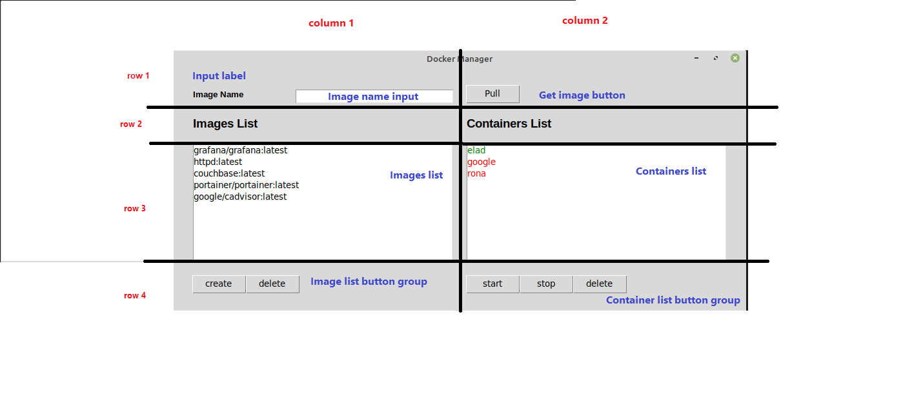
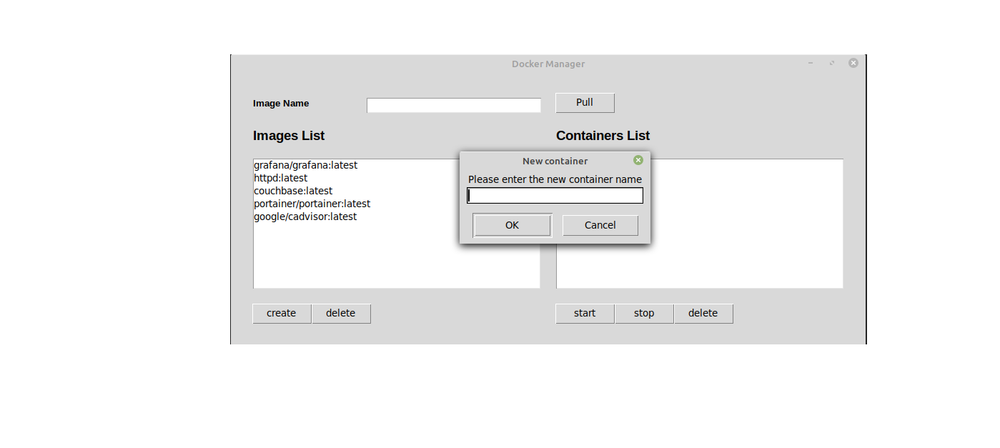
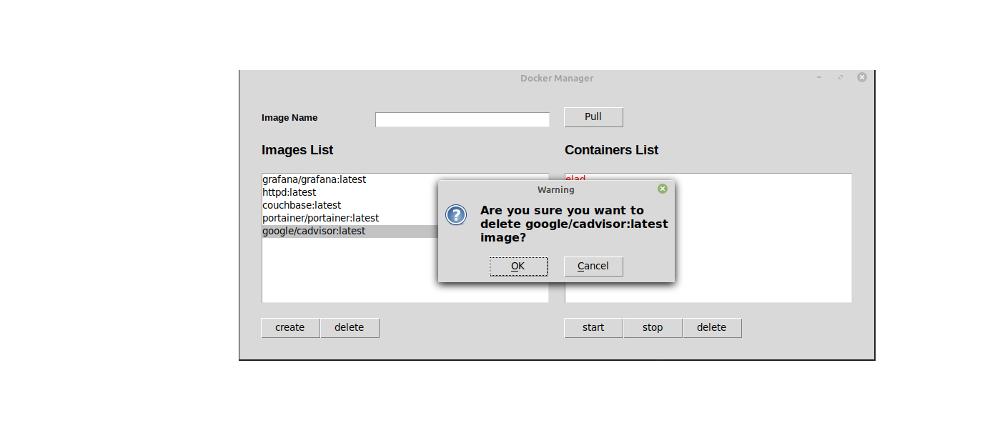
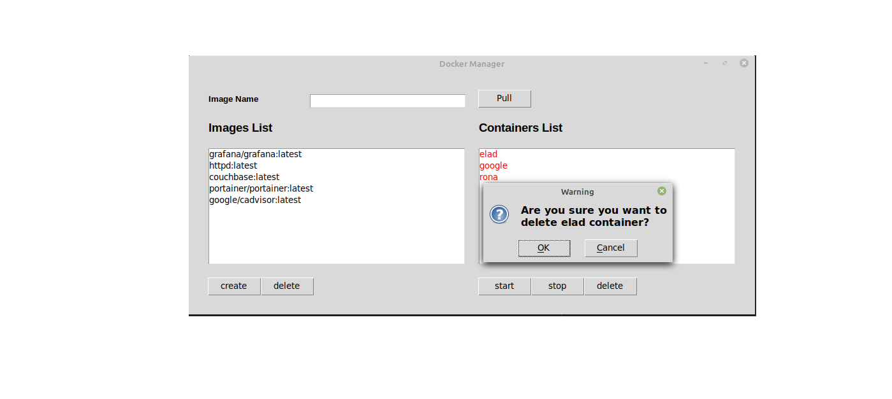

# Docker Manager App

## Introduction

As part of an assignment, I was asked to create an Application that integrates with the docker service and provides different functionalities. As requested, this app provides the ability to manage all of your docker's containers and images.

## General app structure

The Application main functionalities are :
 
- download\delete images
- create\run\stop\delete containers
- view all images and containers

### Layout




### Error handling

In this app I decided to catch all exceptions and show the user errors that are received from docker directly this way the process is more clear to the user and he knows exactly what is wrong.
All exceptions are displayed in a message box dialog.

``If using a linux based operating system, please note that python has to be running with the correct permission in order to access the docker service. Otherwise the app will close with an error.``

## App usage

Here I will provide an overview of all app functionalities.

### Pull Images

In order to pull/download a new image, enter the image name to the input box ("Image Name") and click on the "Pull" butoon.

The image is downloaded in another thread in order not to disrupt the connection to the docker server.
When the download is completed, the image will be displayed within the Image List.

### Create container



In order to create a container, choose an image from the "Image List"; do so by using the computer mouse (You can scroll between the items in the list using the keyboard).
After an image is chosen, click on the "Create" button.
A message allowing the user to choose a name for the container will pop up. In case no name was provided by the user, a default name will be given. The newly created container will be displayed in the container list.

### Delete image



In order to delete an image, choose an image from the "Image List"; do so by using the computer mouse (You can scroll between the items in the list using the keyboard).

After an image is chosen, clicking on the "Delete" button will pop up a message for reverifying the user's wishes to delete the selected image. In case the user clicked on the "Ok" BUTTON the image will be removed from the Images list.

``If trying to delete an image for which containers were created, please note that the docker service won't allow it (an error will be displayed).``

### Start/Stop container

The containers displayed in the container list are marked to indicate the status of the container (red - stopped, green - running). After selecting the relevant container from the list, the user can then click on the "Start" BUTTON to run stopped containers or click on the "stop" BUTTON to stop running containers.
According to the choice made by the user, the container status will change.

### Delete container



After selecting the relevant container from the list, the user can then click on the "Delete" BUTTON to delete stopped containers.
Clicking on the "Delete" button will pop up a message for reverifying the user's wishes to delete the selected container. In case the user clicked on the "Ok" BUTTON the container will then be removed from the container list.

``If trying to delete a running container, please note that the docker service won't allow it (an error will be displayed).``

### Requirements
a. Before running the application verify that you have the following installed:
   1. ##### python installation
      [Installing Python 3 on Linux](https://docs.python-guide.org/starting/install3/linux/)
   2. ##### docker installation 
       [How to Install Docker on Ubuntu](https://www.simplilearn.com/tutorials/docker-tutorial/how-to-install-docker-on-ubuntu)
   3. ##### Docker SDK for Python
       [Docker SDK for Python](https://docker-py.readthedocs.io/en/stable/)
   

b. after completing the installations use the following command in the terminal in the project directory:

``` python3 DockrDeskTop.py ```


